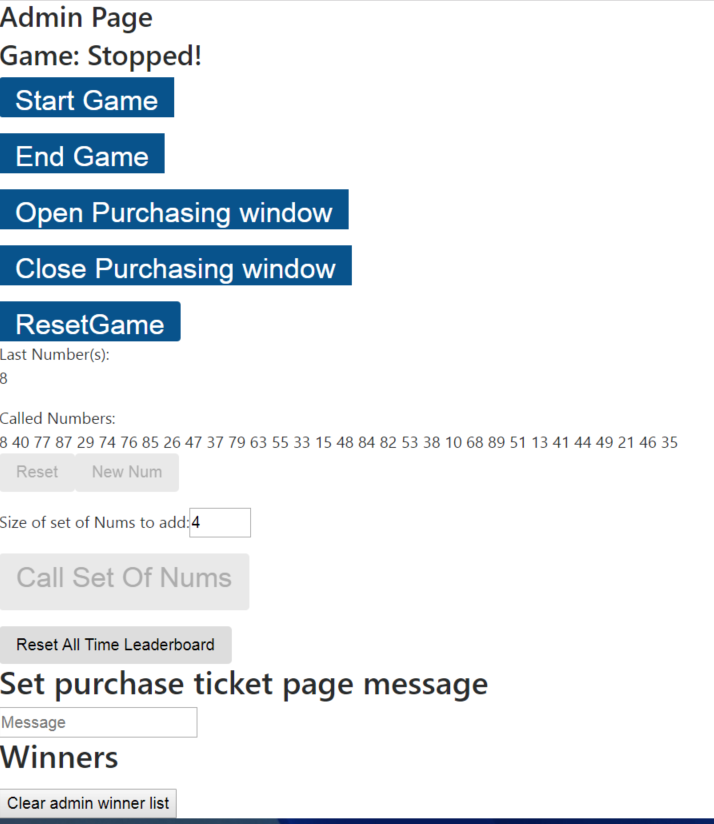

# BT Bingo!

To install:  
git clone https://github.com/Danny-Robinson/bt-bingo.git  
cd bt-bingo  
npm install  
Install <a href="https://www.mongodb.com/download-center#community">mongo</a>  
DEV - npm run dev | PROD - npm start  
  
Kanban board at https://drive.google.com/file/d/0B8sUXLkW28t2dm9GdVY0ZW1rVXc/view?usp=sharing

Main Page

Login Screen

Buy ticket popup

Admin page  

Responsive Designs

**TODO :**
   * Split mongoAPI into seperate concerns, login, tickets, calculations etc.
   * Gracefully fail queries concerning users with no tickets
      
      